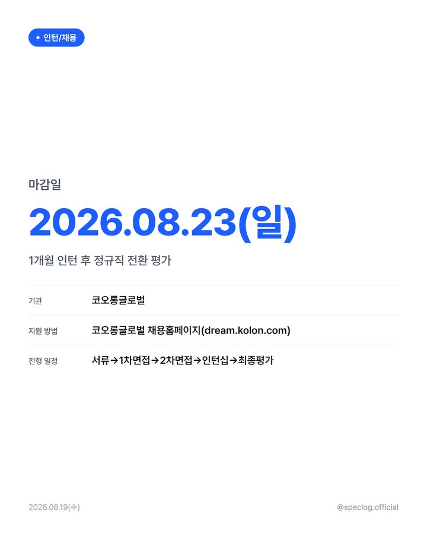
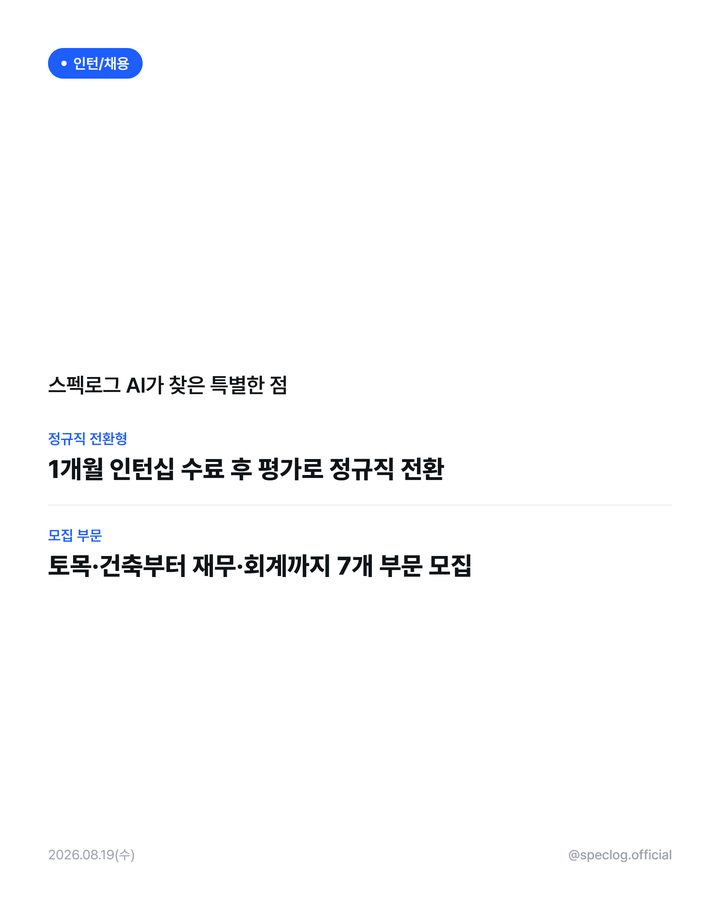
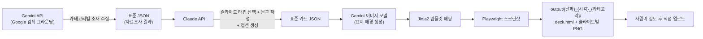

# SPECLOG — 카드뉴스 자동 생성 파이프라인


대학생 대상 커리어 정보(인턴/채용, 대외활동, 자격증, 취업 뉴스)를 매번 사람이 손으로 만드는 대신,
**자료조사 → 카피라이팅 → 이미지 생성 → 디자인 렌더링**까지 자동으로 처리해서 인스타그램에 바로
올릴 수 있는 카드뉴스 한 세트를 만들어주는 파이프라인입니다.

카테고리 하나를 고르면(예: `job`), 3~4분 안에 다음이 나옵니다:

- 표지부터 아웃트로까지 **6~8장짜리 카드뉴스** (PNG 개별 파일 + 스크롤 확인용 HTML 1개)
- 인스타그램에 바로 붙여넣을 수 있는 **캡션** (해시태그·줄바꿈까지 포맷팅 완료)

## 데모

| 표지 | 핵심 정보 | 스펙로그 AI 분석 |
|---|---|---|
|  |  |  |

실제로 이 파이프라인이 만든 결과물입니다 (`--category job` 실행 1회, 문구 수정 없음).

## 왜 만들었나

카드뉴스 계정을 운영해보면 병목은 항상 같습니다 — 소재를 찾고, 사실관계를 확인하고, 문구를 짜고,
디자인에 맞춰 앉히는 반복 작업. 이 프로젝트는 그 반복을 걷어내되, 아래 두 가지는 일부러 자동화하지
않았습니다.

- **AI는 디자인하지 않는다.** LLM이 카드마다 레이아웃을 새로 그리면 품질이 들쭉날쭉해집니다.
  대신 고정된 슬라이드 타입(스키마)에 문구만 채우게 하고, 실제 배치·색상·타이포는 코드로 고정했습니다.
- **업로드는 사람이 한다.** "조사 → 생성 → 렌더링"까지만 자동화하고, 최종 검수와 게시 버튼은
  항상 사람이 직접 누릅니다. 완전 자동 발행이 아니라, 사람의 검토 시간을 아껴주는 도구입니다.

## 어떻게 동작하는가



카테고리마다 콘텐츠의 목적이 달라서, 슬라이드 구성도 3갈래로 나뉩니다.

| 카테고리 | 템플릿 | 슬라이드 수 | 강조 슬라이드 |
|---|---|---|---|
| 대외활동 / 자격증 | 리포트형 | 6장 | 시성비 점수 + Pros/Cons (`ai_analysis`) |
| 뉴스/트렌드 | 브리핑형 | 8장 | 대표 뉴스 상세 + 나머지 뉴스 브리핑 (`info_grid` × 2) |
| 인턴/채용 | 간결형 | 6장 | 기관·지원방법·지원자격 + 차별점 (`highlight`) |

세부 슬라이드 타입 정의와 프롬프트 설계는 [`docs/design.md`](docs/design.md), 제품 요구사항은
[`docs/PRD.md`](docs/PRD.md)에 있습니다.

## 주요 특징

- **카테고리별로 다른 "AI 분석"**: 똑같은 톤의 뻔한 팁 대신, 대외활동은 "준비 노력 대비 경쟁력"
  점수, 뉴스는 "지금 어떻게 대응해야 하는가", 채용은 "이 공고만의 차별점"을 각각 다르게 분석합니다.
- **뉴스는 정보량 우선**: 대표 소재 1건만 우려먹지 않고, 그날 수집한 뉴스 전부를 브리핑합니다.
- **D-day 계산 금지**: "D-7" 같은 계산된 상대 날짜 대신 항상 절대 날짜만 표기해 오해를 없앱니다.
- **채용 정보는 실행 가능한 수준으로**: 회사명·지원 방법·지원 자격을 카드뉴스와 캡션 모두에 빠짐없이 담습니다.
- **인스타그램 포맷팅 자동 처리**: 캡션의 해시태그는 5개로 제한(`#스펙로그` 필수)하고, 줄바꿈은
  특수기호(⠀)로 후처리해 실제로 줄바꿈이 보존되게 만듭니다.
- **비용까지 신경 쓴 파이프라인**: 반복 호출되는 시스템 프롬프트에 Anthropic 프롬프트 캐싱을 적용하고,
  자료조사 단계 텍스트 필드에 분량 상한을 둬서 다음 단계로 전달되는 토큰을 줄입니다.

## 기술 스택

| 영역 | 사용 기술 |
|---|---|
| 자료조사 | Gemini API (Google 검색 그라운딩) |
| 콘텐츠 생성 | Claude API (Anthropic) — API 키 또는 Claude Pro/Max 구독 OAuth 중 선택 |
| 이미지 생성 | Gemini 이미지 모델 (Nano Banana 계열) |
| 렌더링 | Jinja2 (HTML 템플릿) + Playwright (스크린샷) |
| 배포 | GitHub Actions (수동 실행 전용) |

## 프로젝트 구조

```
CardNews/
├── pipeline/
│   ├── generate_only.py             # ★ 진입점 - 1~4단계를 순서대로 실행, 실시간 로그
│   ├── research_gemini.py           # 1단계: 자료조사 (Gemini + Google 검색)
│   ├── generate_content_claude.py   # 2단계: 콘텐츠 생성 (슬라이드 문구 + 캡션)
│   ├── generate_cover_image.py      # 3단계: 표지 배경 이미지 생성
│   ├── render_cardnews.py           # 4단계: HTML 저장 → 슬라이드별 PNG 변환
│   ├── schema.py                    # 카테고리별 템플릿/슬라이드 규격 정의 + 검증
│   └── config.py                    # 환경변수 로더
├── templates/
│   ├── _deck.html                   # 마스터 템플릿 - 카드 1세트를 HTML 1개로 조립
│   ├── _deck_styles.html            # 전체 슬라이드 공용 CSS
│   └── _slide_macros.html           # 슬라이드 타입별 Jinja2 매크로 9종
├── docs/
│   ├── PRD.md                       # 제품 요구사항 정의서
│   ├── design.md                    # 디자인 시스템 (컬러/타이포/슬라이드 카탈로그)
│   ├── SETUP.md                     # API 키 발급 + 실행 환경 설정 가이드
│   └── sample/                      # 이 README의 데모 이미지
├── .github/workflows/speclog-publish.yml  # 수동 실행(workflow_dispatch) GitHub Actions
├── generate.bat / generate.sh       # 원클릭 실행 스크립트 (Windows / macOS·Linux)
└── output/                          # 생성 결과 (실행마다 폴더 1개, git에는 안 올라감)
```

## 시작하기

```bash
git clone <이 저장소 주소>
cd CardNews
pip install -r requirements.txt
playwright install chromium      # 최초 1회, 스크린샷 렌더링에 필요

cp .env.example .env             # GEMINI_API_KEY / ANTHROPIC_API_KEY 채우기
```

API 키 발급 방법은 [`docs/SETUP.md`](docs/SETUP.md)에 단계별로 정리되어 있습니다.

```bash
# 카테고리는 시간과 무관하게 그때그때 원하는 걸 고르면 됩니다
python -m pipeline.generate_only --category job
```

실행하면 콘솔에 실시간 로그가 찍히고, 완료되면 `output/{날짜}_{생성시각}_{카테고리}/` 폴더에
`deck.html`(전체 카드뉴스를 스크롤로 확인) + 슬라이드별 `.png` + `log.txt`가 함께 생성됩니다.
바로 검수할 수 있도록 결과 폴더와 HTML을 새 창으로 열고, 인스타그램 캡션은 클립보드에
자동으로 복사해둡니다. Windows에서는 `generate.bat`을, macOS/Linux에서는 `generate.sh`를
더블클릭/실행해도 같은 흐름이 메뉴 형태로 진행됩니다.

이미 만든 카드 JSON의 문구만 고쳐서 다시 렌더링하고 싶다면:

```bash
python -m pipeline.render_cardnews --card card.json
```

로컬 PC 없이 GitHub Actions에서 수동으로 돌리고 싶다면 `.github/workflows/speclog-publish.yml`
(workflow_dispatch 전용, 자동 스케줄 없음)을 참고하세요.

## 문서

- [`docs/PRD.md`](docs/PRD.md) — 무엇을, 왜 만들었는지 (제품 요구사항)
- [`docs/design.md`](docs/design.md) — 어떻게 생겼는지 (디자인 시스템, 슬라이드 카탈로그)
- [`docs/SETUP.md`](docs/SETUP.md) — 어떻게 실행하는지 (API 키 발급, 환경 설정)

## 라이선스

[MIT](LICENSE)
