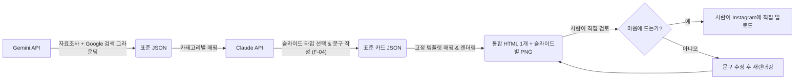

# 스펙로그(SPECLOG) 서비스 제품 요구사항 정의서(PRD)

| 버전 | 일자 | 작성자 | 변경 사항 |
| :--- | :--- | :--- | :--- |
| v1.0 | 2026.07.30 | Product AI | 최초 작성 (사용자 최종 협의 사항 반영) |
| v1.1 | 2026.08.19 | Product AI | 최종 범위 확정: F-01을 "자동 발행"에서 "사람이 검토·업로드하는 원클릭 생성"으로 재정의, F-04를 고정 6슬롯에서 유연한 슬라이드 타입 리스트로 갱신, 텔레그램 검토/인스타그램 자동 업로드를 범위에서 명시적으로 제외(F-06). design.md v2.1 및 실제 구현과 정합화. |
| v1.2 | 2026.08.19 | Product AI | 실제 산출물 피드백 반영: F-04를 5~6장(후킹1+본문4+아웃트로1) 구조로 구체화하고, "저장 가치"의 근거를 `checklist`/`shareable` 슬라이드에서 F-02의 [추천 타깃/합격 팁/주의사항] 분석 자체로 이전(design.md v2.4와 정합화). |
| v1.3 | 2026.08.19 | Product AI | "뻔한 팁 대신 진짜 AI 분석" 피드백 반영: F-02를 [추천 타깃/**AI 시성비 점수 + Pros·Cons 분석**/주의사항]으로 갱신 — 합격 팁은 `ai_analysis`(design.md v2.5)로 대체. |
| v1.4 | 2026.08.19 | Product AI | "카테고리마다 틀이 똑같다" 피드백 반영: F-04를 카테고리 3그룹(리포트형/브리핑형/간결형)이 서로 다른 슬라이드 구성을 쓰도록 갱신, F-02의 "AI 분석"을 카테고리별로 세분화(대외활동·자격증=시성비 점수/Pros·Cons, 뉴스=AI 추천 대응, 인턴·채용=이 공고만의 특별한 점)(design.md v2.6과 정합화). |
| v1.5 | 2026.08.19 | Product AI | 실제 산출물 피드백 반영: F-02에 뉴스는 대표 소재 1건이 아니라 **수집한 뉴스 전부(4건)를 브리핑**해야 함을 명시하고, "AI 분석" 계열 슬라이드는 항상 **"스펙로그 AI"** 브랜딩을 붙이도록 갱신(design.md v2.7과 정합화). 안 쓰이는 슬라이드 타입(tip/checklist/shareable)은 카탈로그에서도 제거. |
| v1.6 | 2026.08.19 | Product AI | "정해진 업로드 시간 없음" 반영: F-01을 시간표 기반("일 3회 다변화")에서 카테고리 선택형으로 재정의하고, 3.1의 시간-카테고리 고정 매핑 표를 폐지. 결과물 폴더명/파일명의 "슬롯"은 예약된 발행 시간이 아니라 실제 생성 시각(HHMM)을 담도록 갱신하고, 생성 1회당 폴더 1개(`output/{날짜}_{생성시각}_{카테고리}/`)로 정리(design.md v2.8과 정합화). 4.1 Bio 문구에서 "매일 08/12/18시 발행" 표현 삭제(더 이상 사실이 아님). |
| v1.7 | 2026.08.19 | Product AI | 캡션/채용정보 피드백 반영: 4.3에 해시태그 규칙(최대 5개, "#스펙로그" 필수 + 범용 노출 태그 1~2개 + 소재 관련 태그 1~2개) 추가, F-02·4.3에 인턴/채용 카테고리는 카드뉴스·캡션 모두에 채용 기업/기관명·지원 방법(지원 가능한 곳)·구체적 지원 자격을 빠짐없이 포함하도록 명시(design.md v2.9와 정합화). |
| v1.8 | 2026.08.19 | Product AI | 캡션 줄바꿈 규칙 추가: 4.3에 캡션 첫 줄과 문단 사이 빈 줄을 특수기호(⠀, 점자 패턴 공백)로 채우도록 명시 — 단순 엔터로는 인스타그램에서 줄바꿈이 보존되지 않기 때문. `generate_content_claude.py`가 캡션 생성 후 자동으로 적용한다(design.md v3.0과 정합화). |

---

## 1. 제품 개요 (Product Overview)

### 1.1. 제품 및 계정명
*   **제품명:** 스펙로그 (SPECLOG)
*   **인스타그램 사용자 이름 (ID):** `@speclog.official`
*   **인스타그램 프로필 이름:** `스펙로그 | 대학생 스펙·취준 전략 리포트`

### 1.2. 한 줄 정의
*   "대학생을 위한 데이터 기반 커리어 전략 리포트 (대외활동·인턴·공모전·취업뉴스 핵심 요약 발행)"

### 1.3. 제품 비전 및 핵심 가치 (Core Value)
*   **비전:** 대학생들이 무분별한 정보 검색에 소요하는 시간을 없애고, 오직 스펙 쌓기와 취업 준비에만 집중할 수 있는 효율적인 커리어 환경 조성.
*   **핵심 가치:**
    1.  **시성비(시간 대비 성과) 극대화:** 3초 안에 핵심 판단이 가능한 정제된 정보 제공.
    2.  **전략적 판단 도구:** 단순 공고 전달이 아닌, 합격 팁, 추천 타깃, 지원 시 맹점 분석을 포함한 '리포트' 형식의 가치 있는 데이터 제공.
    3.  **독립적 권위 구축:** AI틱하거나 타사 공식 자료(예: 토스 스타일)처럼 오해받지 않는 스펙로그만의 단정하고 구조적인(Structured) 디자인 정체성 확립.

### 1.4. 핵심 목표 고객 (Target Audience)
*   취업 준비 및 스펙 쌓기에 관심이 많으나 정보 탐색에 피로감을 느끼는 모든 대학생.
*   특히 고효율 전략을 추구하며, 수치와 데이터 중심의 직관적인 정보를 선호하는 대학생(공학/IT 전공자 등).

### 1.5. 성공 지표 (KPIs)
*   게시물당 **저장(Save)** 수 (정보의 고효율성을 증명하는 핵심 지표).
*   계정 팔로워 수 증가율 및 도달 대비 팔로우 전환율.

---

## 2. 사용자 시나리오 및 기능 요구사항 (User Story & Features)

### 2.1. 사용자 스토리
1.  **취준생:** "바쁜 학기 중에 풀타임 인턴을 신청할지 고민할 필요 없이, 스펙로그 리포트의 '주의할 점(학기 병행 불가)'을 보고 3초 만에 패스 여부를 판단하고 싶다."
2.  **공모전 사냥꾼:** "내 전공에 맞는 공모전을 검색하느라 시간을 허비하지 않고, 스펙로그의 포인트 컬러(예: Cyan)만 보고 관심 있는 공모전의 '합격 팁'만 콕 찝어 읽고 싶다."
3.  **정보 효율 추구자:** "카드를 넘길 때마다 AI가 그린 가상 그래픽 대신, 깔끔한 대시보드 UI에 담긴 정확한 마감일과 혜택 데이터에만 집중하고 싶다."

### 2.2. 핵심 기능 요구사항 (MVP Features)
*   **F-01. 카테고리 선택형 콘텐츠 생성:** 정해진 발행 시간표 없이, 운영자가 그때그때 원하는 카테고리(뉴스/대외활동/자격증/인턴)를 직접 골라 전략 리포트를 생성한다. 현재 범위는 "조사 → 콘텐츠 생성 → 렌더링"까지만 자동화하는 로컬 원클릭 실행(`generate.bat`/`generate.sh`)이다. 자동 스케줄링(cron)은 범위 밖이며, 결과물 폴더명/파일명에는 예약된 슬롯이 아니라 실제 생성 시각(HHMM)을 남긴다.
*   **F-02. 전략 데이터 분석 (카테고리별 스펙로그 AI 분석):** 단순 공고 요약이나 "일찍 지원하세요" 식의 뻔한 팁이 아니라, [추천 타깃, **카테고리에 맞는 AI 분석**, 지원/열람 전 주의사항] 데이터를 필수 포함한다. AI 분석은 카테고리마다 성격이 다르다 — 대외활동/자격증은 **시성비 점수(0~100, "이 소재를 준비하는 데 드는 노력 대비 실제로 얻는 경쟁력"을 근거로) + Pros/Cons**, 뉴스는 **AI 추천 대응(지금 어떻게 대응해야 하는가 + 근거)**, 인턴/채용은 **이 공고만의 특별한 점(전환율·처우 등 차별화 사실)**. 점수/문구는 소재마다 실제로 달라야 하며 모든 포스트가 비슷하게 나오면 안 된다. 이 세 분석 슬라이드는 항상 **"스펙로그 AI"** 브랜딩을 붙여 스펙로그만의 차별화된 정보임을 드러낸다. 뉴스는 대표 소재 1건만 다루지 않고 **그날 수집한 뉴스 전부를 브리핑**해서 "정보 전달"이라는 카테고리 목적에 맞는 정보량을 확보한다. **인턴/채용**은 추천 타깃 대신 **지원 자격**을 다루며, 카드뉴스와 캡션 모두에 (1) 채용 기업/기관명, (2) 지원 방법·지원 가능한 곳(채용 사이트/링크), (3) 원문에 있는 구체적 지원 자격을 빠짐없이 포함한다 — "어디에, 어떻게, 누가 지원하는지"가 카드만 봐도 분명해야 한다.
*   **F-03. 카테고리별 Accent Color 시스템:** 주제별(인턴, 대외활동, 뉴스, 자격증) 고유 포인트 컬러 자동 적용.
*   **F-04. 카테고리별 슬라이드 템플릿:** 디자인 일관성 및 AI 생성 리스크 제거를 위해, AI가 매번 디자인하지 않고 고정된 슬라이드 타입 9종(cover/hero_fact/info_grid/target/ai_analysis/ai_response/highlight/caution/outro, design.md 5장) 중에서 데이터만 채운다(Mapping) — 실제로 쓰이지 않는 타입은 카탈로그에도 남기지 않는다. "다 같은 틀"이라는 피드백에 따라 카테고리 3그룹이 서로 다른 고정 시퀀스를 쓴다: 리포트형(대외활동/자격증, 6장, `ai_analysis`) · 브리핑형(뉴스, 8장, `info_grid` 2장 + `ai_response`로 정보량 강화) · 간결형(인턴/채용, 6장, `highlight`). `cover`·`hero_fact`·`target`·`caution`·`outro`는 세 템플릿 모두 항상 포함한다.
*   **F-05. D-Day 계산 제거:** 시스템 간 날짜 불일치 오해를 막기 위해 카드뉴스 및 본문에서 "D-XX" 형태의 계산된 날짜를 제거하고 오직 마감일(Date) 자체만 명시.
*   **F-06. 검토·발행은 사람이 수동으로 진행:** 텔레그램 자동 검토와 인스타그램 자동 발행(Graph API)은 이 제품의 범위에 포함하지 않는다. 파이프라인 산출물(통합 HTML 1개 + 슬라이드별 PNG)은 사람이 직접 열어 확인하고, 마음에 들면 인스타그램 앱에서 직접 캐러셀로 업로드한다.

---

## 3. 운영 및 시스템 명세 (Operations & System Spec)

### 3.1. 카테고리별 콘텐츠 성격

| 카테고리 | 콘텐츠 성격 | 핵심 가치 | Accent Color |
| :--- | :--- | :--- | :--- |
| **뉴스/트렌드** | IT/산업 트렌드, 채용 시장 동향 브리핑 | 시장 시사점, 면접 밑천 | Emerald Green |
| **대외활동** | 동아리, 공모전 일정 | 저~고학년 공통 스펙 | Cyan |
| **자격증** | 자격증 시험/접수 일정 | 저~고학년 공통 스펙 | Amber |
| **인턴/채용** | 대기업/스타트업/공공기관 공고 | 고학년/취준생 직접 타격 | Electric Blue |

> 정해진 발행 시간표는 없다(F-01) — 운영자가 그때그때 원하는 카테고리를 `--category`로 직접
> 지정해서 생성한다. 결과 폴더명/파일명에는 실제 생성 시각(HHMM)이 남는다.

### 3.2. 콘텐츠 제작 파이프라인 (현재 범위: 조사 → 생성 → 렌더링)



---

## 4. 디자인 및 사용자 경험 (Design & UX)

### 4.1. 계정 프로필 소개글 (Bio)

```
스펙로그 | 대학생 스펙·취준 전략 리포트
대외활동·인턴·취업뉴스 핵심 데이터 요약
⚡ 3초 요약 | 지원자격 | 시성비 평가
🎯 정보 탐색 시간 줄이고 스펙만 챙기세요
```

### 4.2. 카드뉴스 구조 및 디자인 규칙

비주얼 컨셉과 슬라이드 타입 카탈로그의 상세 규격(컬러, 타이포, 슬라이드 타입별 명세)은
**[`design.md`](./design.md)에서 단일 소스로 관리**한다(F-04). 이 문서와 design.md가 어긋나면
design.md를 따른다. 현재(v2.7) 기준 요약:

*   **비주얼 컨셉:** 후킹형 표지(배경사진+블러 완화) + 정제된 리포트 톤. Deep Navy/터미널 UI/Monospace
    같은 "AI가 대충 만든 티" 나는 요소는 금지(design.md 1장). 표/그래프 등 장식적 시각 자료는
    쓰지 않고, 분석 슬라이드의 점수 바 / Pros·Cons 2단 비교 정도로 절제한다.
*   **슬라이드 수:** 템플릿 타입별 고정 (design.md 2장/5장) — 리포트형(대외활동/자격증) 6장,
    브리핑형(뉴스) 8장(정보량 강화를 위해 `info_grid` 2장), 간결형(인턴/채용) 6장.
    `cover`·`hero_fact`·`target`·`caution`·`outro`는 세 템플릿 모두 항상 포함. D-Day 계산
    표기 금지(F-05).
*   **역할 배분:** 후킹(cover) → 핵심 사실(hero_fact, 뉴스는 +info_grid) → 추천 타깃(target) →
    **카테고리별 AI 분석**(대외활동/자격증=ai_analysis 시성비 점수+Pros/Cons, 뉴스=ai_response
    추천 대응, 인턴/채용=highlight 특별한 점) → 주의사항(caution) → 명확한 CTA(outro).

### 4.3. 인스타그램 게시물 본문 (Caption) 규칙

*   카드뉴스 내용의 단순 반복 금지.
*   Gemini가 자료조사 단계에서 수집한 세부 정보를 활용하여 깊이 있는 리포트 형태로 작성한다.
*   순서 고정: **[핵심 요약] → [세부 자격요건 & 우대사항] → [SPECLOG 분석: 성공 전략] →
    [마감 안내] → [해시태그]**.
*   **해시태그는 최대 5개**, 그중 하나는 항상 **"#스펙로그"**. 나머지는 노출이 잘 되는 범용
    해시태그(예: #취업정보, #취준생) 1~2개 + 게시물 소재와 직접 관련된 해시태그(회사명/직무/
    자격증명 등) 1~2개로 구성한다 — 관련 없는 태그로 채우지 않는다.
*   **줄바꿈은 특수기호(⠀, 점자 패턴 공백)로 처리한다:** 인스타그램은 단순 엔터로 만든 빈
    줄을 그대로 유지해주지 않으므로, 캡션 첫 줄과 문단 사이 빈 줄에 보이지 않는 특수기호
    "⠀"를 넣는다 (첫 줄부터 "⠀"로 한 줄 띄우고 시작). 파이프라인이 캡션 생성 후 자동으로
    적용하므로 운영자가 수동으로 편집할 필요는 없다(`generate_content_claude.py`).
*   카테고리가 **인턴/채용**일 때는 [세부 자격요건 & 우대사항] 섹션에 (1) 채용 기업/기관명,
    (2) 지원 방법·지원 가능한 곳(채용 사이트/링크), (3) 구체적 지원 자격을 빠짐없이 명시한다
    — 카드뉴스와 캡션 모두에서 "어디에, 어떻게, 누가 지원하는지"가 분명해야 한다(F-02).

---

## 5. 출시 및 마케팅 전략 (Go-to-Market Strategy)

### 5.1. 초기 차별화 전략

**"지원하지 마세요" 마케팅:** 단순 정보 나열이 아닌, "학기 병행 불가", "비추천 대상" 등
F-02(주의사항/맹점)를 전면에 내세워 '무분별한 지원을 막아 효율을 높여주는 현실적 리포트'라는
정체성을 바이럴시킨다.

### 5.2. 저장 유도 전략

**"마감 3일 전 필수 저장" 캠페인:** 사용자가 정보를 나중에 다시 보기 위해 '저장'하는 행위를
유도하기 위해, 아웃트로 및 본문 캡션에 저장의 이점(예: "마감 전 확인")을 지속적으로 강조한다.